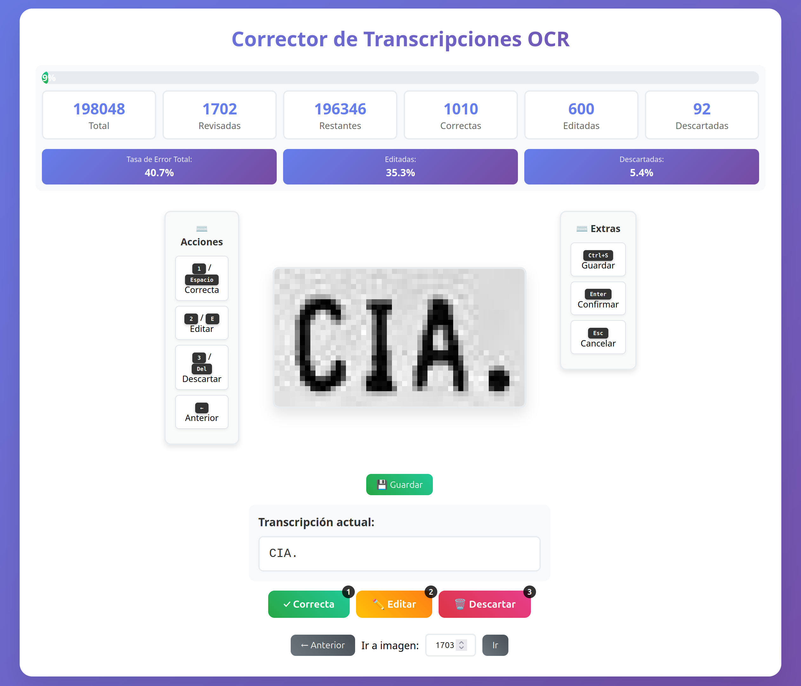

# 📝 Corrector de Transcripciones OCR - Colaborativo

Una aplicación web Flask moderna para revisar y corregir transcripciones OCR de imágenes de palabras de manera colaborativa y eficiente. Diseñada para equipos que necesitan anotar grandes volúmenes de datos de texto con precisión.

## ✨ Características Principales

### 🚀 Colaboración Multi-Usuario
- **Sistema de usuarios robusto** con roles (Admin/Anotador)
- **Base de datos SQLite** para persistencia y concurrencia
- **Panel de administración completo** para gestión de usuarios y tareas
- **Asignación automática** de tareas a usuarios
- **Estadísticas en tiempo real** por usuario y globales

### ⚡ Experiencia de Usuario Optimizada
- **Interfaz moderna y responsive**
- **Hotkeys completos** para navegación rápida (teclado + mouse)
- **Navegación histórica** - navega entre tareas anteriores y siguientes
- **Vista previa de tareas pendientes** en tiempo real
- **Efectos visuales suaves** y confirmación de acciones
- **Estados visuales claros** (Corregido ✓, Aprobado ✓, Descartado 🗑️)

### 📊 Métricas y Monitoreo
- **Estadísticas detalladas** por usuario: total, pendientes, corregidas, aprobadas, descartadas
- **Actividad reciente** con timestamps de última anotación
- **Barra de progreso visual** del proyecto completo
- **Métricas de rendimiento** - endpoints optimizados (~20-80ms)

### 🎯 Funcionalidades Avanzadas
- **Persistencia de sesiones** - continúa donde dejaste
- **Manejo robusto de errores** e imágenes faltantes
- **Carga incremental** y optimizada de datos
- **Indexación de base de datos** para consultas rápidas

## 🖼️ Screenshots

### Interfaz Principal de Anotación


### Panel de Administración


## 🚀 Instalación Rápida

### Prerrequisitos
- Python 3.8+
- Flask y dependencias (ver `requirements.txt`)

### Configuración

1. **Clona el repositorio:**
```bash
git clone https://github.com/tuusuario/labeling-app.git
cd labeling-app
```

2. **Instala dependencias:**
```bash
pip install -r requirements.txt
```

3. **Configura los datos:**
```bash
# Coloca las imágenes en:
mkdir -p data/words_cropped_raw/
# Copia tus imágenes aquí

# La base de datos SQLite se crea automáticamente
```

4. **Ejecuta la aplicación:**
```bash
python app_sqlite.py
```

5. **Accede a la aplicación:**
   - Abre `http://localhost:5000`

## 🎮 Uso y Controles

### Para Anotadores

#### ⌨️ Hotkeys Principales
| Tecla | Acción |
|-------|--------|
| `1` / `Espacio` | ✅ Marcar como correcta |
| `2` / `E` | ✏️ Editar transcripción |
| `3` / `Del` | 🗑️ Descartar imagen |
| `←` | ⬅️ Tarea anterior |
| `→` | ➡️ Siguiente tarea |
| `Enter` | 💾 Confirmar edición |
| `Esc` | ❌ Cancelar edición |
| `L` | 🚪 Cerrar sesión |

#### 📋 Flujo de Trabajo
1. **Revisa la imagen** y transcripción mostrada
2. **Selecciona una acción:**
   - **Correcta:** Si la transcripción es precisa
   - **Editar:** Para corregir errores
   - **Descartar:** Si la imagen no es útil
3. **Navega** entre tareas usando las flechas o historial
4. **Monitorea tu progreso** en las estadísticas superiores

### Para Administradores

#### 👥 Gestión de Usuarios
- **Crear/editar usuarios** con roles específicos
- **Ver actividad reciente** de todos los anotadores
- **Estadísticas detalladas** por usuario y globales

#### 📋 Gestión de Tareas
- **Asignación automática** de N imágenes aleatorias a usuarios
- **Monitoreo en tiempo real** del progreso del proyecto
- **Vista general** de imágenes completadas vs. pendientes

#### 🔄 Modo Dual
- **"Ir a Anotar"** - Los admins pueden anotar como usuarios regulares
- **Cambio fluido** entre panel admin y vista de anotación

## 🏗️ Arquitectura del Proyecto

```
Labeling_app/
├── 🐍 Backend Python
│   ├── app_sqlite.py           # Aplicación principal SQLite
│   ├── models/
│   │   └── database.py         # Modelos de BD (User, Image, Annotation)
│   ├── services/
│   │   └── database_service.py # Lógica de negocio
│   ├── routes/
│   │   └── sqlite_api_routes.py # API REST endpoints
│   └── config.py               # Configuración
│
├── 🎨 Frontend
│   ├── templates/
│   │   ├── sqlite_index.html   # Interfaz de anotación
│   │   ├── sqlite_admin.html   # Panel de administración
│   │   └── sqlite_login.html   # Página de login
│   ├── static/
│   │   ├── js/
│   │   │   ├── core/                # Config, JWT, HTTP helpers (ES Modules)
│   │   │   ├── services/            # Lógica de acceso a API
│   │   │   ├── controllers/         # Coordinan vista + servicios
│   │   │   ├── components/          # UI reutilizable (modals, tabs, toast, etc.)
│   │   │   └── views/               # Entrypoints por vista (login.js, annotator.js, admin.js)
│   │   └── css/
│   │       ├── base.css             # Tokens + utilidades compartidas
│   │       ├── annotator.css        # Estilos específicos (no críticos)
│   │       ├── admin_mod.css        # Estilos específicos admin
│   │       ├── login.css            # Estilos específicos login
│   │       ├── annotator.bundle.css # Base + annotator (minificado, precargado)
│   │       ├── admin.bundle.css     # Base + admin (minificado, precargado)
│   │       ├── login.bundle.css     # Base + login (minificado, precargado)
│   │       └── styles.css           # (LEGACY VACÍO) – mantenido solo para evitar 404 temporales
│
├── 📊 Base de Datos
│   └── labeling_app.db         # SQLite (se crea automáticamente)
│
├── 📁 Datos
│   └── data/
│       └── words_cropped_raw/  # Imágenes a anotar
│
└── 🛠️ Configuración
    ├── requirements.txt        # Dependencias Python
    ├── gunicorn.conf.py       # Configuración para producción
    └── start_server.sh        # Script de inicio
```

## 📡 API Endpoints

### Autenticación
- `POST /api/v2/login` - Iniciar sesión
- `POST /api/v2/logout` - Cerrar sesión
- `GET /api/v2/me` - Información del usuario actual

### Tareas de Anotación
- `GET /api/v2/task/next` - Obtener siguiente tarea
- `GET /api/v2/task/history` - Historial de tareas
- `GET /api/v2/task/pending-preview` - Vista previa de pendientes
- `GET /api/v2/task/load/<id>` - Cargar tarea específica
- `PUT /api/v2/annotations/<id>` - Actualizar anotación

### Administración
- `GET /api/v2/admin/users` - Listar usuarios
- `POST /api/v2/admin/users` - Crear usuario
- `POST /api/v2/admin/assignments/auto` - Asignación automática
- `GET /api/v2/admin/stats` - Estadísticas globales

### Utilidades
- `GET /api/v2/stats` - Estadísticas del usuario
- `GET /images/<filename>` - Servir imágenes

## 🤝 Contribuir

1. **Fork** el proyecto
2. **Crea una rama** (`git checkout -b feature/nueva-caracteristica`)
3. **Commit** tus cambios (`git commit -m 'Añadir nueva característica'`)
4. **Push** a la rama (`git push origin feature/nueva-caracteristica`)
5. **Abre un Pull Request**

## 📈 Roadmap

- [ ] **Exportación de datos** en múltiples formatos
- [ ] **Importación masiva** de imágenes y transcripciones
- [ ] **Métricas avanzadas** con gráficos
- [ ] **Notificaciones en tiempo real**
- [ ] **API pública** para integraciones
- [ ] **Soporte multi-idioma**

## 📄 Licencia

Este proyecto está bajo la **Licencia MIT** - ver [LICENSE](LICENSE) para detalles.


**¿Necesitas ayuda?** Abre un [issue](https://github.com/tuusuario/labeling-app/issues) o contacta al desarrollador.

**⭐ ¿Te gusta el proyecto?** ¡Dale una estrella en GitHub!

## 🧩 Notas sobre Optimización Frontend Reciente
- Migración completa a ES Modules (sin funciones globales inline).
- CSS crítico inline + preload asíncrono de bundles (admin, annotator, login) para reducir FOUC.
- Bundles minificados combinan base + vista específica.
- `styles.css` deprecado y vaciado (se puede eliminar tras validar cachés).
- Clases en `<body>`: `admin-view`, `annotator-view`, `login-view` para scoping.
